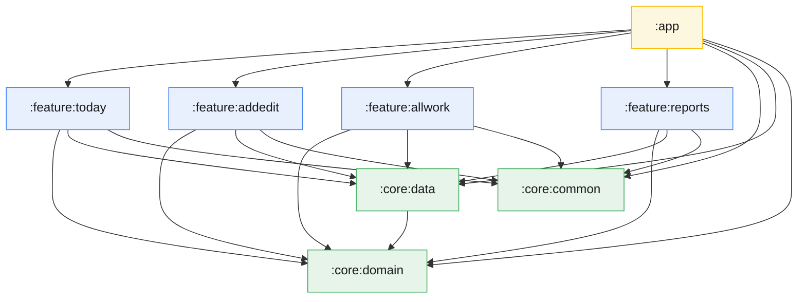

# Trackora

An offline-first Android app for tracking piecework — the kind of record-keeping a tailor, workshop, or repair shop does by hand at the end of each day.

[](https://github.com/zr-evergreen/Trackora/actions/workflows/ci.yml)
[](LICENSE)
[](https://kotlinlang.org)
[](https://developer.android.com)

## Screenshots

| Today | Add entry | All work | Reports |
| :---: | :---: | :---: | :---: |
|  |  |  |  |

| Jalali date picker | Persian (RTL) |
| :---: | :---: |
|  |  |

## Why this exists

Small workshops in Iran track output on paper: what was made, how many, whether it has been delivered, whether it has been paid for. Paper is fine until you need last month's total.

Trackora keeps that same daily rhythm but makes the totals free. It works entirely offline because the shops it is built for do not reliably have data, and because nobody should have to hand their income records to a server to add them up. It speaks Persian, uses the Jalali calendar, and lays out right-to-left, because the alternative is asking people to do arithmetic in a calendar they do not use.

## Features

- **Work entry management** — create, edit, and track entries with three user-nameable custom fields
- **Status tracking** — in progress, completed, delivered
- **Reports** — daily, weekly, and monthly summaries over any date range
- **Jalali calendar** — Persian Solar dates throughout, including the date picker
- **Bilingual** — English and Persian, with full RTL layout
- **Photo attachments** — attach a picture to any entry
- **Reminders** — a WorkManager job flags entries left in progress
- **Material 3** — light, dark, and system themes
- **Fully offline** — no network permission, no analytics, no third-party SDKs

## Architecture

Seven Gradle modules in a Clean Architecture arrangement:



Dependencies point inward. `:core:domain` is the centre and depends on nothing in the project.

### Why the domain layer has no Android dependencies

`:core:domain` contains the models, the repository *interface*, and the use cases. It has no reference to `Context`, Room, Compose, or anything else from the platform. Two things follow from that:

- **Its tests are plain JVM tests.** No emulator, no Robolectric, no `@RunWith`. The 13 use case tests run in milliseconds, which is why they get run on every save rather than every so often.
- **The business rules can move.** Nothing in that module knows it is running on Android. Making it a Kotlin Multiplatform module is a change of build file and a swap of `java.time` for `kotlinx-datetime`, not a rewrite.

The data layer depends on the domain layer and implements its interface, so the dependency arrow points from the concrete thing to the abstract one. The database can be replaced without the use cases noticing.

### Data flow

```
UI (Compose)  →  ViewModel  →  UseCase  →  Repository (interface)
                                                 ↑
                                          RepositoryImpl  →  Room DAO  →  SQLite
```

Reads come back as `Flow`, so Room's own invalidation drives recomposition: saving an entry causes the Today screen to update without anyone writing refresh logic. ViewModels expose a single immutable `uiState: StateFlow<T>` per screen.

### Why Clean Architecture for an app this size

It is more structure than 5,300 lines strictly needs, and picking it for a solo project is a real trade-off — more modules, more indirection, more files to open to follow one change.

What it buys here is test isolation and build times. Every layer has a seam that can be faked, which is what makes 111 unit tests practical without an emulator; and touching one feature module recompiles that module rather than the app. The layout was also chosen with the Koin and KMP migrations below in mind — both are far cheaper when the domain layer is already isolated.

## Tech stack

| | |
| --- | --- |
| Language | Kotlin 2.0.21 |
| UI | Jetpack Compose, Material 3 |
| Architecture | Clean Architecture, 7 modules |
| DI | Hilt |
| Database | Room |
| Preferences | DataStore |
| Async | Coroutines, Flow |
| Background work | WorkManager |
| Images | Coil |
| Serialization | kotlinx.serialization |
| Build | AGP 8.13.2, Gradle 8.13, version catalog |

**Testing:** JUnit 4, MockK, Turbine, `kotlinx-coroutines-test`, Room in-memory database.

## Testing

```bash
./gradlew testDebugUnitTest              # 111 unit tests
./gradlew :core:data:connectedDebugAndroidTest   # 21 DAO tests, needs a device
```

| Suite | Tests | What it covers |
| --- | ---: | --- |
| `JalaliCalendarTest` | 18 | Gregorian ↔ Jalali conversion, leap years, month boundaries, a 10,000-day round trip, and Nowruz checked against the published dates for 1399–1408 |
| `AddEditWorkViewModelTest` | 22 | The create/edit seam, validation, save failures |
| `TodayViewModelTest` | 16 | Loading, error paths, entry creation |
| `WorkEntryUseCasesTest` | 13 | All eight use cases against a mocked repository |
| `AllWorkViewModelTest` | 11 | Filtering and state |
| `WorkEntryRepositoryImplTest` | 11 | Repository against a mocked DAO |
| `ReportsViewModelTest` | 10 | Range selection, aggregation |
| `WorkEntryMapperTest` | 10 | Entity ↔ domain round trips, null handling |
| `WorkEntryDaoTest` | 21 | Real SQLite: queries, ordering, range boundaries, Flow invalidation |

The DAO tests are instrumentation tests because they exist to check the two things a mock cannot: Room's generated query implementations, and the type converter that stores `LocalDate` as an ISO-8601 string. Date ranges are compared with `>=` and `<=`, which SQLite evaluates lexicographically on text — correct only because ISO-8601 zero-pads. CI runs them on **API 24** specifically, since that is where `java.time` has to resolve through core library desugaring rather than the platform.

## Building

### Prerequisites

- Android Studio Ladybug or later
- JDK 17
- Android SDK, API 24+ (Android 7.0)

### Debug

```bash
git clone https://github.com/zr-evergreen/Trackora.git
cd Trackora
./gradlew assembleDebug
```

### Release

1. Generate a keystore:
   ```bash
   keytool -genkey -v -keystore trackora-release.jks \
     -keyalg RSA -keysize 2048 -validity 10000 -alias trackora
   ```

2. Create `keystore.properties` in the project root (it is gitignored):
   ```properties
   storeFile=../path/to/trackora-release.jks
   storePassword=your_store_password
   keyAlias=trackora
   keyPassword=your_key_password
   ```

3. Build:
   ```bash
   ./gradlew assembleRelease   # APK, for Bazaar and Myket
   ./gradlew bundleRelease     # AAB
   ```

### Versioning

The version is defined in `app/src/main/java/com/evergreen/trackora/util/AppVersion.kt` and read by the build script at configure time, so the constants and the manifest cannot drift apart.

## Notes

**minSdk 24 and `java.time`.** `java.time` requires API 26. Rather than raise minSdk and drop Android 7 users — still a meaningful share of the Iranian market — the project enables `coreLibraryDesugaring` in all eight modules. The API 24 CI job exists to keep that honest, because the failure mode is a runtime `NoClassDefFoundError` that no amount of compiling proves absent.

## Roadmap

- [ ] CSV export and JSON backup/restore
- [ ] Bazaar and Myket release
- [ ] Migrate Hilt → Koin (KMP-compatible, and drops kapt)
- [ ] Move `:core:domain` to Kotlin Multiplatform
- [ ] Charts in Reports
- [ ] Home screen widget

## License

MIT — see [LICENSE](LICENSE).
